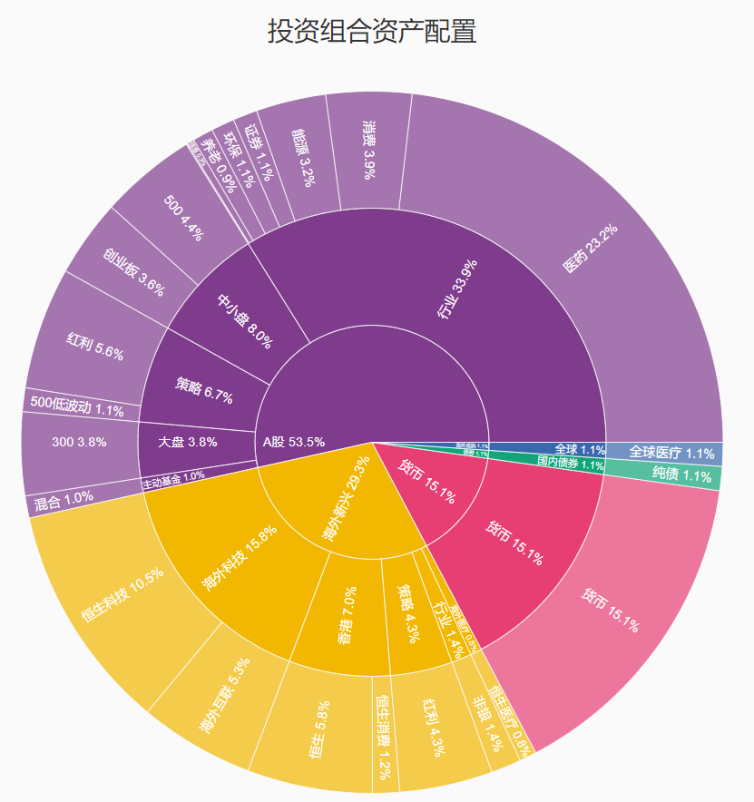

# 投资组合旭日图生成工具(Portfolio Sunburst Generator)

## 项目简介

这是一个用于分析和可视化投资组合资产配置的Python工具。通过生成交互式旭日图(Sunburst Chart)，帮助投资者直观地了解自己的资产分布情况。该工具将投资组合中的各项资产分为三级分类，并计算各分类的市值占比，最终生成美观且可交互的旭日图。

## 功能特点

- 根据市值截图自动ocr，对投资组合中的资产进行三级分类
    - 支持：华宝证券、海通证券、基金e账户
- 生成旭日图展示资产配置
- 提供详细的投资组合摘要报告，包括各分类的市值和占比
- 支持导出高质量PNG图片

## 安装方法

### 依赖项

- Python 3.6+
- pandas
- plotly
- 其他依赖项在requirements.txt中列出

### 运行步骤 

1. 克隆项目到本地
2. 安装依赖项: `pip install -r requirements.txt -i https://pypi.tuna.tsinghua.edu.cn/simple/`
3. 在手机上将支持的证券的持仓截图（手机长截图）放到项目的screenshots文件夹，没有文件夹可以自己创建
4. 运行：`python portfolio_analyzer.py --image screenshots --use_saved_ocr`

运行完后会生成一个portfolio_sunburst.html，浏览器打开即可

## 待解决问题

- 网页上导出的图片部分数据异常
- 点击二级分类后部分数据异常